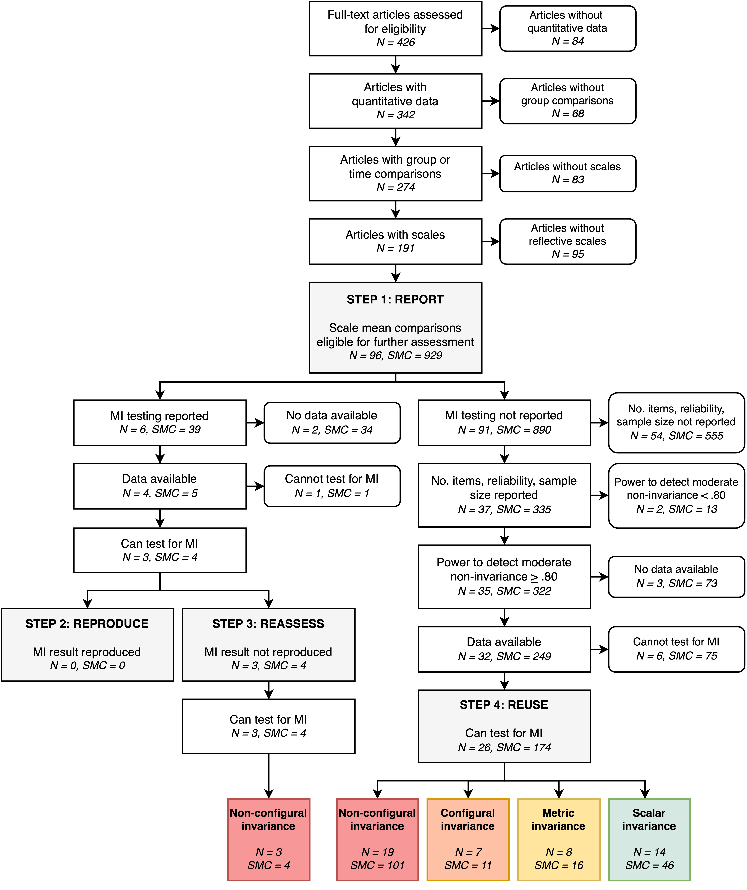
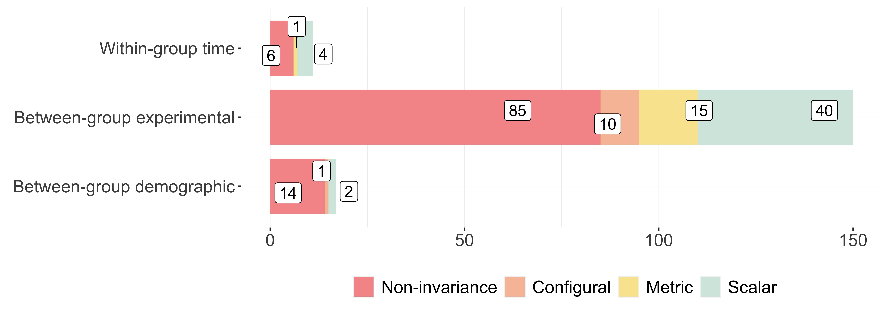

```{r setup, include=FALSE}
devtools::session_info()
```

\setlength\parindent{34pt}
Researchers in the social and behavioral sciences frequently examine if latent psychological constructs (e.g., depression) vary between groups, experimental conditions, or measurement occasions. Typically, these constructs are measured by administering (self-report) scales, yielding scores that are assumed to reflect the construct of interest. To ensure that observed differences are not due to measurement distortion (i.e., bias) but are actual differences in the construct of interest, it is essential that the construct is measured equivalently across groups or over time, and that measurement invariance (MI) holds [@meredith2006; @millsap2012]. Violations of MI can be caused by various factors that differentially affect the measurement in certain groups or time, such as changes or differences in response styles [@cheung2000; @liu2017; @rios2021], latent dimensionality [e.g., different constructs measured across time points or groups$;$ @vogelsmeier2019], cultural interpretations [@dong2020], or (experimental) effects that directly affect scale items rather than the targeted latent constructs [@wicherts2005].

Latent variable models allow rigorous tests for MI [@millsap2012]. Specifically, these models offer tests to determine whether the relations between unobservable latent variables (e.g., depression) and observable scale item responses [e.g., on the Beck Depression Inventory$;$ @beck1996] are invariant across groups and time points. Latent variable modeling assumes a reflective—as opposed to formative—measurement model, where the constructs are seen as causally affecting behaviors as reflected by the items via factor loadings [@bollen1989; @borsboom2003]. Factor loadings indicate the strength of the relationship between latent variables and individual items and may also be interpreted as regression coefficients. There are several tests available for assessing MI, which differ in the assumptions made about the scale of the item responses (e.g., dichotomous, ordinal, or continuous), the scale of the latent variables (e.g., continuous or categorical), and the testing procedures [@durso2021; @meade2004]. In this study, we focus on multiple-group confirmatory factor analysis (MGCFA) because it is the most popular method for assessing MI in reflective psychological scales composed of continuous or ordinal (Likert-type) items [@putnick2016].

Assessing violations of MI is important, as measurement non-invariance may lead to an over- or underestimation of observed mean differences or invalid inferences on latent constructs. For example, imagine a study aimed at reducing depression, in which self-reported depression scores of participants receiving cognitive behavioral therapy are compared to self-reported depression scores of a waitlist control group. Ideally, the variance in the items explained by the latent depression construct is equivalent in both groups. However, it is conceivable that therapy targets a particular subset of items in the scale, while not affecting the other items. For instance, the therapeutic intervention could reduce selective attention to negative thoughts, thereby causing a response change (or shift) for items related to negative thoughts, such as “I feel I am a complete failure as a person” and “I feel guilty all the time” [e.g., @fokkema2013]. This results in individuals from different groups with the same latent depression score having different predicted values for these items. In other words, the way the depression construct is measured in the therapeutic group is recalibrated, which leads to measurement non-invariance on the items. A comparison of scale sum scores either between groups or over time would not be able to highlight this change or other observed group differences that go beyond group differences in the latent variable of depression. As a result, neglecting measurement non-invariance with respect to (experimental) conditions or time may lead to over- or underestimating the true effect and erroneous or incomplete inferences about psychological constructs and what affects them.

MI is typically tested in a stepwise fashion to evaluate which comparisons across (experimental) groups or time points can validly be made, starting with configural invariance [@vandenberg2000; @widaman1997]. If configural invariance holds, the number of latent variables and factor loading pattern are the same in all groups. If metric or weak invariance holds, factor loadings are measured equivalently across groups and may be compared [@meredith1993]. Next, if scalar or strong invariance holds, item intercepts or thresholds are invariant, and latent mean differences between groups may be interpreted [see @wicherts2010]. To obtain full factorial invariance, the equivalence of the residual variances (i.e., residual or strict invariance) may be tested, but residual invariance is not required for comparing latent mean differences and is often skipped in practice. Additionally, a partial invariance test allows some of the loadings, intercepts, thresholds, or residual variances to vary across groups, while testing invariance of the remaining measurement parameters [@byrne1989].

Despite the importance of MI and the attention it has received in a wide range of fields [e.g., @putnick2016; @schmitt2008; @vandenberg2000], tests of MI remain relatively uncommon [@boer2018]. There may be situations in which MI does not hold but where it has little practical implications, such as when the MI test is statistically significant but the absolute parameter differences are small and do not substantially affect the results or conclusions. Moreover, minor MI violations may be more critical in some contexts (e.g., clinical decisions) than others (e.g., consumer preferences). Nevertheless, before researchers can determine if violations of MI have practical implications, they must first test for it. Without MI testing, researchers remain in the dark about whether observed differences between groups are due to measurement bias, which also undermines the generalizability of the findings. In addition, there can be considerable variability in reporting practices when researchers perform MI testing, and there are different recommendations on which MI tests should be conducted and their order [@vandenberg2000]. Reports of MI testing are often unclear and regularly lack important information on model fit, sample size, and degrees of freedom [@putnick2016], meaning readers are unable to assess the validity of statistical inferences made in a study [@flake2020]. 

It is essential to adopt good reporting practices for MI, as even the seemingly innocuous omission of scale validation information can hinder the assessment of measurement validity and its subsequent results. Reporting guidelines for MI include, among others, information on the scale and its measurement properties, whether the scale was previously validated for the sample under study, the type of MI test, the constraints in the measurement model, and the chosen goodness-of-fit statistics and corresponding cutoff values [@putnick2016]. Due to the complexity of statistical models in MI testing, adequate reporting can be challenging and ultimately hinder the interpretability and reproducibility of analyses and results. Fortunately, the increased attention towards assessing and improving research credibility has seen an increase in methodological reporting practices in various fields [e.g., @imam2019; @weiss2023]. Moreover, many journal policies mandate authors to make their data—and sometimes code—publicly available, and an increasing number of researchers report sharing their data and materials [e.g., @kidwell2016; @neve2021]. This development allows for others to use the data to reproduce results computationally or conduct further or alternative analyses, thereby enhancing the robustness of findings.

In this article, we aimed to assess the degree to which MI is tested and how often it holds in psychological studies that compare scale mean scores across (experimental) groups or over time. We sampled 426 articles with open data from two psychology journals, which reported a total of 929 scale mean comparisons (hereinafter “comparisons”). Our objectives were fourfold: first, to determine the frequency of reported MI tests for groups and time points and how they were reported (Step 1: report); second, for studies that assessed MI, to evaluate whether the results of these tests could be reproduced computationally using the authors’ methods, evaluation criteria, shared data and code (Step 2: reproduce); third, if these studies were not computationally reproducible, to perform a MI test using predefined methods and evaluation criteria (Step 3: reassess); and fourth, to assess MI in a sample of studies that did not report MI testing but conducted group or time comparisons on scale mean scores, using shared data (Step 4: reuse). These steps will provide valuable insights on reporting and reproducibility practices, as well as the prevalence and implications of measurement non-invariance in published psychology papers.

# Method

## Pilot study
Before conducting the main study, we preregistered ([osf.io/6rfy5](https://osf.io/6rfy5)) and conducted a pilot study to ensure the feasibility of the project, the suitability of the chosen journals, and the reliability of our coding protocol. We sampled 60 articles with open data published between 2011 and 2016 from the journals *Judgment and Decision Making*, *PLOS ONE*, and *Psychological Science*, and evaluated their reporting practices. Furthermore, we attempted to reproduce the reported MI tests for articles that compared a scale mean across groups or time, and in cases where authors made comparisons but did not report on MI, we attempted to perform a MI test by reusing the data.

After conducting a pilot study we improved the design of the main study in several ways. Initially, we planned to also include articles without open data in our sample, but due to the time-consuming nature of coding and the many articles that did not meet our inclusion criteria, we decided to limit our sample to articles with open data. This allowed us to more effectively assess reproducibility and data reusability in a larger sample. We also faced challenges in agreeing on what constituted a principal outcome in a study (a common issue in meta-research), so we included all outcomes that compared a scale across groups or over time. To avoid an overreliance on a narrow set of absolute and relative fit measures, we supplemented our measures with two information criteria that consider model parsimony: the Akaike information criterion (AIC) and Bayesian information criterion (BIC). Additionally, we adjusted our cutoff criteria to align more closely with the specific characteristics of our sample, details of which are provided below the 'Step 3' heading in this Method section. Finally, as many studies appeared to be underpowered, we decided to only conduct MI tests for studies with sufficient statistical power to detect non-invariance. We reported on the changes made and the results from the pilot study in online addendum A: [osf.io/a9sug](https://osf.io/a9sug). Subsequently, we developed a new preregistration for the main study ([osf.io/s96gc](https://osf.io/s96gc)), which is detailed in the following section.

## Data and sampling

To investigate to what extent researchers generally use scale means to compare groups or time points, we sampled articles from two journals on general psychology: *Psychological Science* (PS) and *PLOS ONE* (PLOS). Since PLOS requires authors to make their data publicly available while PS does not, we first sampled from PS all articles with openly available data published in 2018 (*N* = 114) and 2019 (*N* = 99). To ensure an equal sample for PLOS, we randomly sampled 114 and 99 articles from 2018 and 2019, respectively, using the rplos package [@chamberlain2021] in R [@r2023]. We sampled articles containing "psychology" as the subject area and only retained full research articles, resulting in a total of 426 articles. We did not specify any hypotheses regarding differences between the two journals, and will present the results of the total sample in the main text.

## Procedure

Our unit of analysis is the scale mean comparison, which we defined as a quantitative comparison of scale means between two or more categorical groups or time points. We first documented whether the 426 articles used quantitative human data and stopped the coding process for articles using simulation or animal data or those that were commentaries, meta-analyses, or theoretical articles. After identifying articles that used quantitative data, we determined whether the article included group or time comparisons, and further distinguished whether these groups were based on research design manipulations (e.g., experimental conditions or time points) or demographic information (e.g., country or age). As the last step, we coded whether the authors compared the groups on one or multiple scales. Our inclusion criteria for psychological scales required that the scale measured at least three items, with a total or sum score calculated, and the authors aimed to measure a latent construct that was assumed to cause variation in the item scores, indicative of a reflective measurement model. We considered three indicators for this: we assessed if authors either (a) provided a citation of a validation study or prior use of the scale. Such references suggest some previous examination of the use and interpretation of the scale scores; (b) reported psychometric analyses, such as factor analysis, which indicate the authors investigated the dimensionality of the construct and its relationship with the observed items; or (c) considered the internal consistency of the items, for instance, by providing reliability estimates of (sub)scales. If any of (a)-(c) were reported, we deemed the scale to be appropriate for MI testing.

## *Step 1: Report*
The first step involved assessing all comparisons for MI reporting practices. We recorded whether the scale was an original (i.e., unedited) or ad hoc (i.e., newly constructed or modified) scale, as well as the items’ response scale (i.e., dichotomous, ordinal, or continuous), the number of response categories (e.g., a seven-point Likert scale), the number of items, the total sample size and reliability estimate, the sample size and reliability estimates per group, and the reported statistical power of the study. Next, we coded whether the authors assessed MI by reporting whether MI held or by reporting testing procedures. If the authors reported specifics of their MI testing approach, we determined whether they tested for MI at the scale or item level and which level of MI held (i.e., none, configural, [partial] metric, [partial] scalar, or [partial] residual invariance).

## *Step 2: Reproduce*
In the second step we focused on the subset of comparisons that reported on MI. For this subset, we evaluated the computational reproducibility of the MI tests and results. Using the reported information and shared materials and code, we attempted to retrieve and open the data, and to identify and construct the grouping variable and items belonging to the scale. Even if the analysis was suboptimal for the research design (e.g., if authors measured items with dichotomous response scales but used MGCFA, which assumes continuous response scales), we aimed to exactly reproduce the analysis and results as the authors reported. We attempted to reproduce the estimates to the closest integer ($\chi^2$, degrees of freedom) or two decimals (e.g., root mean square error of approximation [RMSEA], comparative fit index [CFI]). Computational reproducibility was achieved if we obtained the reported model fit estimates and reached the same invariance conclusion as the authors (e.g., scalar invariance) using reported decision rules and cutoff values (e.g., $\Delta$RMSEA > .01).

## *Step 3: Reassess*
For the comparisons that we failed to computationally reproduce in the previous step, in Step 3, we aimed to test for MI using alternative approaches and decision rules that we deemed appropriate. We used the standard scale-level MGCFA approach and carried out MI testing in a stepwise manner. We began by testing for configural invariance, where only the form of the measurement model (i.e., which items are measured by which latent variables) is restricted to be equal across all groups or time points[^1]. Unless otherwise specified in the article, we assumed a measurement model with a single latent variable that measured all items in a scale. If configural invariance held, we proceeded to test for metric invariance by constraining the factor loadings to be equal across all groups or time points. If metric invariance was established, we tested for scalar invariance by constraining the intercepts to be equal across all groups. Example R code to carry out these steps is available at [osf.io/btnur](https://osf.io/btnur). 

[^1]: When estimating the configural and metric invariance models, the latent variances are estimated freely in all groups and all latent means are constrained to zero. When testing for scalar invariance, the latent variances and latent means are estimated freely in all groups, except for the latent mean in one arbitrarily chosen (reference) group, which is constrained to zero.

Our selection of fit measures and criteria for rejecting MI were based on frequently cited simulation studies and the prevalence of fit measures in the existing literature. Previous research has identified the CFI, gamma hat, RMSEA, McDonald’s noncentrality index (NCI), and standardized root mean square residual (SRMR) as appropriate fit measures for measurement invariance testing [@cheung2002; @chen2007]. Both a previous study [@jackson2009] and our pilot study indicated that the $\chi^2$ test, CFI, and RMSEA were the most frequently reported measures in psychology. As such, we opted for a combination of absolute (the $\chi^2$ test) and relative (CFI and RMSEA) fit measures, further supplemented by two information criteria (AIC and BIC) in the main study. We excluded gamma hat and McDonald’s NCI as they are seldom reported. While the SRMR was considered, it was ultimately excluded because it is more sensitive to non-invariance in factor loadings than intercepts, and because its rejection rates are larger in scenarios of full invariance compared to other fit measures [@chen2007].

For scales where the number of response categories for each item was less than or equal to five, we tested for MI using the guidelines for ordered categorical data proposed by @wu2016. We based conclusions regarding the level at which MI held on commonly accepted guidelines [@chen2007; @cheung2002]. That is, we rejected configural invariance if we observed a statistically significant $\chi^2$ test ($\alpha$ < .05) and at least one of two alternative fit measures exceeded their cutoffs (RMSEA > .08, CFI < .95). We rejected metric invariance if we observed a statistically significant $\chi^2$ difference between the configural and metric invariant model, and at least two out of four alternative fit measures exceeded their cutoff values ($\Delta$RMSEA > .01, $\Delta$CFI < -.01) or had larger estimates than in the configural step (AIC, BIC). Finally, scalar invariance was rejected if we observed a statistically significant $\chi^2$ difference between the metric and scalar invariant model, and at least two out of four alternative fit measures exceeded their cutoff values ($\Delta$RMSEA > .01, $\Delta$CFI < -.01) or had larger estimates than in the metric step (AIC, BIC). For scales with only three items it was not possible to calculate the $\chi^2$, RMSEA, and CFI estimates since the configural invariance model was just-identified with zero degrees of freedom. Therefore, we assumed configural invariance for scales with three items and rejected metric invariance if the $\chi^2$ test was significant and RMSEA > .08 or CFI < .95. For each comparison included, we coded if we could perform a MI test, whether MI held, and at which level it held.

## *Step 4: Reuse*
Step 4 involved using the comparisons that did not report on MI and were not included in Step 2 or 3. For these comparisons we only tested for MI if there was sufficient statistical power to detect a moderate amount of measurement non-invariance on the scalar level. To calculate this power, we first selected all comparisons that reported an overall reliability estimate, the total number of items in the scale, and sample size. We then calculated the average interitem correlation[^2] and took the square root as an average factor loading value. For each comparison and group we simulated a covariance matrix for a single-factor model. We used the calculated average factor loading as input for all factor loadings. To simulate moderate intercept non-invariance, we added an intercept difference of 0.5 for half the groups and one-third of the indicators (e.g., for a scale with 15 items measured across four groups, we simulated an intercept difference for five items in two groups)[^3]. We then fit a model in which the factor loadings were set to be invariant across groups (i.e., metric invariance model) and a model in which the factor loadings and item intercepts were set to be invariant (i.e., scalar invariance model). Using the difference in $\chi^2$ values and degrees of freedom of these two models we calculated a statistical power estimate to detect a moderate level of intercept non-invariance for all comparisons. We selected all comparisons with a power estimate of 0.80 or larger and attempted to perform a MI test given the data, code, and reported information. We coded the same variables for the obtained results as in Step 2 and 3. Example code for this step is available at [osf.io/8zpx7](https://osf.io/8zpx7).

[^2]: The average interitem correlation was calculated as $\overline{r}_{xx'} = \frac{\alpha}{n - \alpha(n-1)}$ where $\alpha$ is Cronbach's alpha and $n$ is the number of items in the scale.

[^3]: Since we used a standardized solution and set the latent variances to 1, an intercept difference of 0.5 can be interpreted as a standardized mean difference of *d* = 0.5. This value is commonly used as an estimate for a medium effect size [@cohen1988].

## Transparency and Openness
Our study design and analysis plan were preregistered ([osf.io/s96gc](https://osf.io/s96gc)). All data, analysis code, and research materials needed to reproduce the analyses and results are available at [osf.io/j72t4/](https://osf.io/j72t4/). We inadvertently omitted two variables from our preregistered codebook: the number of items in a scale and whether the data from the article were accessible. Additionally, we failed to provide information on model identification constraints in the preregistration. When information on identification constraints was not available in the articles, we followed the default constraints in the lavaan package [@rosseel2012] for MGCFA and those proposed by @wu2016 for multiple-group categorical confirmatory factor analysis (MGCCFA). We made three modifications to the simulation study. First, we used the reported information from the articles to calculate the average interitem correlation for each comparison separately instead of assuming a fixed interitem correlation for the entire sample. Second, we simulated intercept non-invariance, not loading non-invariance, as the aim of the simulation was to estimate statistical power to detect intercept non-invariance and our sample of comparisons concerned mean differences between groups. Finally, to ensure the MI test had sufficient statistical power to detect non-invariance, we selected only the comparisons with a power estimate equal to or larger than 0.80 instead of 0.70.

Data were analyzed using R, version 4.3.1 [@r2023], and we used the following packages to process and analyze the data: data.table [@dowle2023]; dplyr [@wickham2023-dplyr]; GPArotation [@bernaards2005-gpa]; haven [@wickham2023-haven]; Hmisc [@harrell2023]; httr [@wickham2023-httr]; psych [@revelle2023]; readxl [@wickham2023-readxl], rempsyc [@theriault2022] and writexl [@ooms2023]. For simulating data, we used faux [@debruine2023-faux] and truncnorm [@mersmann2023]. We used lavaan [@rosseel2012] and semTools [@jorgensen2022] to test for MI, and all figures were created using ggplot [@wickham2016] and ggrepel [@slowikowski2023].

# Results
## Step 1: Report
We selected 426 articles from PLOS and PS that had open data or an open data statement to assess the reporting practices of articles using comparisons. The flowchart, shown in Figure 1 and categorized by journal in online addendum B ([osf.io/6bthp](https://osf.io/3k5cv)), details the selection process and dropout rate for each of the four steps involved in the analysis. The 426 articles contained 841 studies, of which we excluded the following: studies without quantitative human data, i.e., theoretical articles, commentaries, simulation-, animal-, and qualitative studies (84 articles with 93 studies); studies without any group or time comparison (68 articles with 133 studies); and studies that did not compare mean scores of groups using scales of at least three items (83 articles with 218 studies). We further excluded studies with scales that did not meet the criteria for a reflective measurement model (95 articles with 248 studies). In total, 96 articles (23%) containing 149 studies (18%) remained, which included 929 comparisons. We further analyzed these comparisons to evaluate reporting and reproducibility practices related to MI.

**Figure 1**

*Flowchart of Articles and Comparisons with Resulting Levels of Invariance*

```{r flowchart, echo=FALSE, fig.align='center', out.width = '100%'}

```

*Note*. *N* denotes articles and *SMC* denotes scale mean comparisons.

Table 1 shows that out of the 929 comparisons that were analyzed, a majority (595, 64%) involved ad hoc constructed groups or time points, such as participants randomly assigned to different experimental conditions or measured before and after an intervention. In contrast, around one-third of the comparisons (334, 36%) were made between preexisting groups based on demographic characteristics such as gender or nationality. More than half of all comparisons were made with modified scales (492, 53%). In many instances we were unable to retrieve the number of items (287 comparisons, 31%), the number of item response categories (317 comparisons, 34%), or both (206 comparisons, 22%). The number of items ranged from 3 to 135 (median = 7), and the number of item response categories ranged from 2 to 81 (median = 5).

[Table 1]

A relatively small percentage of comparisons lacked sample size information (53 comparisons, 6%), while more than half did not have a reported reliability estimate (514 comparisons, 55%). It was common for studies to provide only one sample size and reliability estimate despite reporting multiple group or time comparisons per scale. The total sample size ranged from 15 to 4.4 million (median = 418), and the total sample reliability ranged from 0.46 to 0.97 (median = 0.84). Additionally, we observed a positive correlation between the reported reliability estimates and the number of items (*r* = .35), which aligns with the Spearman-Brown formula[^4].

[^4]: Predicted reliability after shortening or lengthening a test is calculated as $\rho_{xx'}^{*}={\frac {n{\rho }_{xx'}}{1+(n-1){\rho }_{xx'}}}$, where ${\rho }_{xx'}$ is the reliability of the current test, and *n* is the factor by which the number of items changes.

More than half of the sample did not include a sample size justification or any statistical power estimate (59 articles and 76 studies), despite both PS and PLOS noting in their submission guidelines that authors should provide one. It was exceedingly common for studies to provide a statistical power estimate and sample size justification for the entire sample or primary test, but then to perform multiple (subgroup) tests with varying sample sizes. Consequently, we chose not to investigate the reported statistical power further as it would not provide information on the comparisons being studied. 

We contend that MI tests must be performed for all 929 comparisons in the remaining 96 articles to unambiguously interpret the results in terms of the targeted latent variables. However, MI was only mentioned for 39 comparisons (4%), all of which were reported in six articles. Out of these six articles, four were validation studies that assessed the psychometric properties of scales, while the remaining two articles involved an experiment and a cross-cultural study. Furthermore, in 37 out of 39 cases where MI was reported, the comparisons were between groups differentiated by demographic variables, such as gender and marital status.

A total of 30 comparisons reported using an item-based method test, specifically differential item functioning investigated with a Multiple Indicators and MultIple Causes (MIMIC) model. Of these, eight comparisons found evidence of differential item functioning for a subset of items, whereas 22 comparisons found no evidence of differential item functioning, indicating measurement invariance of the items. For nine comparisons, a scale-based method (i.e., MGCFA or MGCCFA) was used to test MI. MI was reported to be tenable for these comparisons at different levels, including metric invariance (five comparisons), partial scalar invariance (one comparison), and scalar invariance (three comparisons).

To assess coder agreement in step 1, we calculated the interrater reliability for central variables using Cohen’s $\kappa$ [@cohen1960]. The resulting interrater reliability was high, with $\kappa$ = 0.77 for coding studies that included quantitative human data, $\kappa$ = 0.95 for coding studies that included a comparison, and $\kappa$ = 1 for coding comparisons that reported a MI test and MI result. However, the interrater reliability for indicating whether an article included group or time comparisons was low ($\kappa$ = 0.32). This was largely due to difficulties in determining the number of eligible comparisons and statistical tests in some articles. The remaining steps were jointly assessed by the first two authors.

## Step 2: Reproduce
We aimed to assess the computational reproducibility of MI tests for 39 comparisons reported in 6 articles by reproducing the MI tests exactly as they were originally reported. Although all six articles indicated that their data were publicly available, we were unable to access and use the data for three articles—one cross-cultural and two scale validation studies. The reasons for data unavailability were either authors indicating that data would be available upon request, or inaccurately reporting that all relevant data were included in the article (34 of 39 comparisons, 87%). For example, one study provided data on sum scores but did not include individual item scores, which were necessary for the analyses. We were able to locate, download, and open the data for five comparisons across four articles.

In order to perform the MI tests, our initial step was identifying the grouping variable and constructing a scale. We successfully identified the grouping variable for all five remaining comparisons. To construct a scale we required either the individual item scores or a covariance or correlation matrix of the variables that make up the scale. We were able to obtain this information for four comparisons from three articles (one experiment and two scale validation studies), and subsequently conducted four MI tests.

We were unable to computationally reproduce any of the four MI tests. The main obstacle was inferring all the author's choices from the manuscript, since no code was shared with the data. Even though the authors provided a substantial amount of information in the manuscripts, deciphering the exact steps and choices they made proved challenging. For instance, the first article indicated that the authors accounted for the categorical nature of the items. However, the reported degrees of freedom suggested they treated these items as continuous. In the second article the model fit steps were ambiguously described, and we found discrepancies in our estimated model's CFI and RMSEA values. For both articles we may have unintentionally deviated from the original article's measurement model, specifications, or estimations. For the third article, we had access only to the covariance matrices and not the raw data, preventing us from using the same estimation method as the authors.

Because our results did not support the measurement invariance conclusion reported in the original articles, we could not confirm that invariance held across populations for the two validation studies, nor could we rule out that the results in the experiment study were due to differences in measurement across conditions. We did not contact the authors for further clarification on their analytic choices, as our goal was to assess computational reproducibility, which entails all necessary information is available alongside the published article.

## Step 3: Reassess
In the previous step we encountered difficulties in reproducing the MI results for four comparisons from three articles. Subsequently, we attempted to evaluate MI for these four comparisons using preregistered estimation methods, fit indices, and cutoff criteria. According to the original articles, partial scalar invariance held for one comparison and full scalar invariance held for the other three. However, when we applied our methods and cutoffs, we found that configural invariance did not hold for any of the comparisons, leading us to cease further testing. In all four cases, the $\chi^2$ test showed a statistically significant result and either the RMSEA or CFI exceeded the cutoff criteria. Altogether, we found violations of configural invariance for all four comparisons.

## Step 4: Reuse
In the fourth step, our objective was to perform MI tests on 890 comparisons from 91 articles. None of these comparisons reported a MI test and thus were excluded from previous analyses. We began by selecting comparisons that reported the sample size, number of items and a reliability estimate (335 comparisons from 37 articles) to estimate the statistical power required to detect a moderate level of scalar non-invariance. We then excluded comparisons with a power estimate less than 0.80, resulting in a sample of 322 comparisons from 35 articles that could be subjected to a sufficiently powerful MI test. Out of these 322 comparisons, we were able to recover data for 249 comparisons (from 32 articles). For the other 73 comparisons (from 3 articles), we encountered issues of data unavailability, either due to inaccessible online repositories or authors incorrectly stating all relevant data were included in the paper or supporting information. Among the 249 comparisons, we were able to construct a grouping variable for 239 and a scale for 175 comparisons, and ultimately conducted MI tests on 174 comparisons (54%, in 26 articles). The model fit statistics for these comparisons can be found in online addendum C: [osf.io/aepkr](https://osf.io/aepkr).

Out of the 174 comparisons, 61 had only three items (35%, across 13 articles). Given that the configural invariance model had zero degrees of freedom in such cases, we assumed configural invariance for all 61 comparisons, and assessed them only for metric and scalar invariance. Nine comparisons remained at the configural level (15%), 14 comparisons indicated metric invariance (23%), and 38 comparisons indicated scalar invariance (62%). 

Among the 174 comparisons, 113 were made with scales with more than three items (65%, across 20 articles). Configural invariance was rejected for almost all of these comparisons: 101 out of 113 (89%). Out of the 12 comparisons for which some level of invariance held, two showed support for configural, two for metric, and eight for scalar invariance.

Figure 2 displays the levels of invariance for all MI tests conducted in the Reproduce, Reassess, and Reuse steps, categorized by the type of group comparison: within-group over time, between-group experimental, and between-group demographic. Across all groups, the majority of comparisons resulted in configural non-invariance, indicating the absence of a stable item structure. Evidently, only a small percentage of comparisons showed the necessary level of scalar non-invariance.

**Figure 2**

*Levels of Invariance for 178 Comparisons Tested in Step 2 to 4*
```{r stackedbar, echo=FALSE, fig.align='center', out.width = '100%'}

```

*Note*. "Within-group time" refers to comparisons within a group over time. "Between-group experimental" refers to comparisons between ad hoc constructed groups, e.g., control and treatment. "Between-group demographic" refers to comparisons between demographic groups, e.g., gender or country. 

## Exploratory Analyses
In addition to our preregistered plan, we conducted some exploratory analyses that were not part of our initial registration. In our sample, authors tended to combine all items in a scale, assuming a unidimensional factor structure in the data. We found that configural invariance was rejected for 101 out of 113 comparisons that had more than three items, which led us to analyze factor retention for these comparisons. We used Parallel Analysis, a technique that compares the eigenvalues of the observed data to those of randomly generated data sets of the same size and retains factors from the observed data that exceed the 95th percentile of the simulated eigenvalues [@horn1965; @revelle2023]. We performed Parallel Analysis using common factor analysis on all comparisons for the entire sample and then for each group separately (see online addendum C: [osf.io/aepkr](https://osf.io/aepkr)). The majority of comparisons (84 out of 101) revealed more than one underlying factor in the total sample. A single factor was observed for 17 comparisons, indicating that dimensionality was not the cause of the configural invariance violation. For 46 comparisons, the number of factors varied between groups. These findings underscore the importance of addressing issues related to measurement invariance in psychology, but also those related to measurement in general.

# Discussion

Self-report scales are frequently used in psychological research to compare means across time points, groups, or experimental conditions. To ensure that these comparisons are unbiased and meaningful, the scales must exhibit (scalar) measurement invariance (MI). We investigated common practices for conducting and reporting of MI testing in 426 articles from two general psychology journals with openly available data. Our findings revealed that although scale mean comparisons are common in psychological research, there is a serious lack of attention to measurement and conducting and reporting of MI tests. Out of 96 articles with mean comparisons, only six contained information on MI. Of these six, four were scale validation studies where MI testing is a standard step. Poor reporting practices and inaccessible data in a large proportion of the sample prevented us from assessing the reproducibility of the MI tests and from reanalyzing the data. Of the newly performed MI tests, only a third reached sufficient scalar invariance, while for half of the comparisons configural invariance was rejected. These frequent violations of MI suggest that reported group differences may not solely be attributed to group differences in latent constructs.

## Limitations

This study has some limitations. First, for the three articles reporting MI tests, the authors concluded that MI was tenable while we found the opposite result. It is possible that our failure to reproduce the results is unrelated to MI but rather stems from different choices in data processing or model construction and selection. This could have resulted in us using alternate estimators and possibly evaluating different measurement models. Given the limited number of comparisons we could investigate, this result does not necessarily indicate a deeper problem with measurement non-invariance, and it is important not to overgeneralize our conclusion on MI violations in these cases.

Another limitation of this study is the substantial dropout of articles and comparisons. We aimed to assess reporting practices and reproducibility of scales used to estimate mean differences in psychological constructs. In line with our preregistration and based on their common use in psychology and in cross-cultural studies, we only considered categorical grouping variables and excluded comparisons involving continuous grouping variables[^5]. When assessing reproducibility, we excluded three studies due to poor data accessibility and insufficient descriptions of the data, mostly due to a lack of annotated analysis scripts. In the end, we could only test four out of 39 comparisons for computational reproducibility. Moreover, when we attempted to calculate statistical power to detect scalar non-invariance for the comparisons in our sample, we had to exclude 555 eligible comparisons from the reanalyses (Step 4) because they did not report sample sizes, number of items, or a reliability estimate. Considering these issues, we recommend caution when generalizing our results to other types of studies, scales, and group comparisons.

[^5]: Methods available to assess MI across continuous grouping variables exist [@bauer2017], and are available in open-source software, such as the mnlfa package in R [@robitzsch2022b].

In light of our findings, we further investigate and address several issues and recommendations related to measurement invariance, general scale measurement, and reproducibility in psychological research.

## A Critique of Measurement Invariance

MI testing and the relative importance of non-invariance have been extensively debated for decades [e.g., for a recent discussion on invariance testing in cross-cultural research, see @fischer2022; @meuleman2022; @robitzsch2022a; @welzel2021]. A common criticism of MI testing is that it often involves using strict statistical tests that can reject the null hypothesis of zero difference with any negligible magnitude of non-invariance in large samples [@hu1998; @saris2009]. However, our finding that admittedly strict tests of MI often show failures of invariance highlights the importance of understanding why it fails. It is advisable not to outright dismiss the entire model when faced with non-invariance; instead, applying strategies that address non-invariance can be beneficial in many instances. If configural invariance fails, researchers might consider using multigroup exploratory factor analysis with appropriate rotation [@deroover2019] to assess the dimensionality of scales across groups. Researchers may also test for partial invariance by identifying non-invariant parameters through modification indices, expected parameter change, or residual covariance matrix inspection and allowing them to vary across groups [e.g., @fox2010; @muthen2012; @oberski2014; @saris1987]. Nevertheless, while these procedures may improve model fit, they are often based on post hoc data-driven decisions that capitalize on chance and may lead to overfitting the model to improve fit. Consequently, the model may lose its original meaning and fail to cross-validate in the same population or generalize to other populations [@maccallum1992]. As a result, researchers still face challenges in determining when non-invariance becomes practically meaningful, as well as understanding its implications for the interpretation of the construct.

## What Is Too Much Non-Invariance?

Unfortunately, there are no clear-cut guidelines to follow when determining if statistically significant non-invariance is also practically meaningful, as it depends on factors specific to the research context. The magnitude of the violation in relation to the expected target effect and the number of non-invariant items should be considered [@borsboom2006; @nye2018], and standardized effect size measures can provide information on the magnitude of measurement non-invariance that is comparable across studies [e.g., @gunn2019; @nye2018]. An understanding of the context in which MI testing occurs is also important; the impact of non-invariance may be greater for some items in a scale than others, depending on the content of the item and goal of the study. For instance, rejections of MI may have greater implications in developing medical diagnostic tools, as incorrect measurement can result in serious implications for patient health. Similarly, cross-cultural comparisons may require higher levels of invariance to ensure that complex constructs can be validly compared across different cultures. These issues should ideally be considered before MI testing occurs.

## Implications for the Meaning of the Construct

Non-invariance has important implications for our understanding of the construct’s nature and related causal mechanisms. With a few exceptions, the scales in our sample were combined into a single total score, with little detail provided regarding their dimensionality. However, when a one-factor model was tested, configural invariance was rejected for 101 out of 113 comparisons (89%). Further inspection indicated more than one underlying factor for 84 of these 101 (83%) comparisons. For instance, a ten-item self-centrality scale indicated two factors for one group and three for the second group. In such instances, insight into the factor structure could have allowed for further investigation of MI and a clearer representation of group dynamics in the data.

Unexpected uni- or multidimensionality may indicate several things, such as differences in the item loading pattern across groups, an additional factor not captured by the model, an experimental manipulation or treatment introducing an additional factor, or the absence of a stable underlying structure for the measures. Although invariance testing cannot confirm if items are good conceptual indicators of a construct [@fischer2022] non-invariance can suggest that the construct may have a different conceptual meaning in (experimental) groups (i.e., configural non-invariance) or that (experimental) group differences on the same items may be due to systematically biased scale scores (i.e., loading or intercept non-invariance). As a misspecification of the underlying model could lead to other conclusions about differences between groups [@nye2011], detecting non-invariance in a scale is essential when one wishes to make valid inferences about group differences in the measured construct.

## Considerations in Measurement Invariance Testing

When conducting MI testing, several important issues need to be considered to ensure the robustness of testing and subsequent interpretation of results. Researchers need sufficient statistical power to detect non-invariance, as insufficient power can result in imprecise estimates, misspecified parameters, and failures to detect meaningful differences in measurement properties. Prior power analyses are not always straightforward as various factors can affect the required sample size, such as the number of variables, the magnitude of factor loadings, the severity of misfit, and the goal of the test [e.g., model convergence or the detection of specific parameters or model misspecification$;$ @wang2021; @wolf2013]. To simplify this process, researchers can make use of tutorials and interactive apps for sample size planning [e.g., @jak2021; @jobst2023], power analysis to detect target effects [@wang2021], and even power analysis to detect response shift in structural equation models [@verdam2022].

Another important consideration in MI testing involves constraining at least one model parameter to be invariant across groups, thereby serving as a reference point for detecting potential non-invariance in other parts of the model. The identification constraints are commonly set by fixing the latent variable mean to 0 in the reference group and one factor loading to 1 in all groups. These choices require careful consideration; finding a completely invariant item is challenging without strong theoretical and empirical support, and failing to do so can significantly affect results [e.g., @chang2017]. Nevertheless, ongoing research is contributing to the development of methods to identify invariant referent items [for a comparison of the strengths and weaknesses of various methods, we refer to @thompson2020].

Researchers should also carefully consider the fit measures and cutoffs they plan to use to evaluate model fit. While there are numerous goodness-of-fit indices and cutoffs available for assessing model fit, researchers—including us—often resort to commonly used and widely accepted fit indices and demarcation criteria [e.g., @chen2007; @cheung2002]. However, their suitability can differ based on the data and model characteristics. Fortunately, open-source R packages and web-based applications now provide dynamic fit index cutoffs for increasingly complex model characteristics and multiple levels of misspecification [@mcneish2023; @wolf2023]. These advances save researchers from having to learn complicated simulation techniques.

MI results should be reported according to established guidelines, such as those by @putnick2016, which include providing information on total and group sample sizes, missing data, fit criteria and fit measures, and the related invariance conclusion for all fitted models. Sharing results is particularly important in the context of MI testing, which involves the estimation of multiple models and many parameters. In optimal conditions (e.g., the absence of missing data, normality), sharing a covariance matrix and mean scores of all observed variables allows interested readers to reuse data for other purposes. However, especially in structural equation modeling research, sharing syntax is essential to evaluate model specifications and decisions, as they are often unavailable upon request [@wicherts2017]. Overall, proper planning, reporting, and sharing of MI testing results are necessary to ensure the findings’ validity and reproducibility.

## Ad hoc Scales Prevail

This study has not only raised concerns about MI testing, but also highlighted the inadequate attention to measurement practices and reporting. A key issue identified was the lack of scale evaluation for numerous psychological scales. Twenty percent of scales were not accompanied by citations to previous studies, while 80 percent lacked information about their underlying factor structure. Additionally, for half of the scales the authors did not report reliability estimates, only a few authors reported group-level reliabilities, and for one-third of the scales the authors did not report the number of items. Adding to these concerns, we found that half of the scales we examined had items altered, removed, or added. These modifications were rarely justified, and in most cases led to MI violations.

In psychological research, the proper use and validation of scales is essential. Scales must undergo psychometric evaluation of their dimensionality, (item) structure, and reliability, even when sum scores are used [@mcneish2020]. After establishing the scale's structure, a priori hypotheses about its invariance across groups or over time can be tested. Researchers are therefore advised to prioritize the use of scales with strong validity evidence rather than haphazardly developing ad hoc scales or modifying earlier scales, which may not retain their intended measurement properties. However, the limited availability of scales with strong validity evidence in psychology can make it challenging for researchers to find suitable measurement instruments for their studies. This constraint may motivate or even compel them to adapt existing scales.

Nonetheless, altering an existing scale essentially requires a reevaluation of its underlying structure. Ideally, the modified scale should be piloted in an independent sample prior to being used in group comparisons [see for instance @ziegler2014]. Subsequent MI testing can verify that the changes have not inadvertently introduced dimensionality differences or group-specific biases. Given the prevalence of modified scales in our sample, combined with observed MI violations and disparities in group dimensionality, we urge researchers to assess a scale’s factor structure and reliability separately for each group they analyze, especially when using modified scales.


## Improving Measurement Practices

Improving measurement practices without corresponding transparent reporting is suboptimal. Clear and transparent reporting allows others to grasp the measurement procedures and how the results were obtained, assess the credibility of the results, and identify possible errors. Furthermore, the absence of reported measurement decisions complicates or even precludes others from reproducing the results and using them in future studies. Researchers should therefore provide detailed measurement information, including the rationale for selecting a specific scale, the method of calculating scale scores, the analyses performed (and for which groups), along with basic descriptive data about the scale, such as (sub)sample size, scale length, and level of measurement. This information should be included not only for psychometric or scale validation studies, but also for all psychological studies that use psychological scales, either in the manuscript or in supplemental materials.

Reporting guidelines and considerations, such as the COnsensus-based Standards for the selection of health Measurement INstruments (COSMIN) guidelines for clinical research [@gagnier2021] and six questions on measurement practices proposed by @flake2020, can assist researchers in transparent reporting. However, collaborative efforts are still necessary to develop, adapt, and widely disseminate reporting guidelines for psychological measurement. Journals can contribute to standardizing the reporting process by requiring measurement sections in the methods that contain specific headings for independent and dependent variables, measures, scale modification, and factor and reliability analysis results. Additionally, journals can provide a checklist to authors to ensure that necessary psychometric information is included in manuscripts or supplemental materials. Implementing these measures can help streamline the process of extracting information from articles and ensure that important measurement information is not overlooked in psychological research.


## Reproducibility Issues in Psychology

A final issue this study highlights is the considerable concern regarding the reuse of open data sets. The lack of adherence to FAIR principles [Findable, Accessible, Interoperable, and Reusable$;$ @wilkinson2016] was a significant impediment to our efforts to reproduce analyses and reanalyze data. A few times the data were not findable or accessible due to broken, incorrect, or poorly indicated links to repositories, but the most significant obstacle to our efforts was the interoperability and reusability of the data. Incomprehensible data and poor documentation of the research process considerably prolonged the time needed to perform (re)analyses, and the information and data provided were often insufficient. When performing MI tests, this occurred when the data set did not include individual item scores but only contained sum or composite scores. Furthermore, many studies in our sample did not upload code, despite PLOS journals and PS open data badges requiring researchers to provide access to annotated author-generated code used for all analyses upon publication. Our findings, combined with prior research, suggest that sharing code with the data is crucial to reproducing results or using the data for other purposes, as the data are often not shared or inaccessible and unintelligible for outside readers.

## Why Not Contact the Authors?

The findings of our study are consistent with previous research indicating that open data badges or mandatory open data policies do not necessarily guarantee actual data availability or independent computational reproducibility [@cruwell2023; @hardwicke2021; @hardwicke2018b]. In the current study we did not contact any of the original authors if the data were unavailable or were not accompanied by sufficient information to be reusable, but we assume the number of reproducibility checks and MI tests we could perform would have been higher if we had done so. Hardwicke et al. (2018b, 2021) found that author assistance resolved reproducibility issues in 31% to 38% of articles, particularly through follow-up on unclear or incomplete reporting of analytic procedures.

However, there are multiple reasons why we focused on independent assessments of reproducibility and hence decided not to contact authors for clarification. First, computational reproducibility refers to instances in which the article and supplemental materials are self-contained and require no further explanation to verify reported results. When we found that MI reporting practices were severely lacking, we approached the issue from the standpoint of an individual researcher who aims to evaluate MI independently. The ability to rerun analyses or to perform additional analyses, such as MI tests, is an important aspect of scientific inquiry, and researchers need to rely on the information provided in an article, particularly when data are shared for scientific purposes. Second, non-response to initial or follow-up emails for data sharing requests is high, with response times often extending to several months [@wicherts2006; @vines2014; @teunis2015; @vanpaemel2015; @hardwicke2018a]. Third, a sizable proportion of results in previous studies remained irreproducible even with author involvement [37% and 28% of articles in @hardwicke2018b; @hardwicke2021]. Nonetheless, we acknowledge that in future work involving larger samples it would be informative to collaborate with original researchers, to gain a more comprehensive understanding of the theoretical and practical implications of non-invariance and to reach a consensus on the tenability of MI in specific datasets.

## Playing FAIR

We recognize that making research data and code Findable, Accessible, Interoperable, and Reusable requires a significant investment of time, skill acquisition, institutional and infrastructural support. There are also legitimate reasons why some researchers choose not to share their data and code, such as ethical or privacy concerns. Furthermore, data are often lost or misplaced when researchers leave or change academic institutions, when computers crash, or when technology becomes outdated. Despite these challenges, we strongly believe that the advantages of making data FAIR far outweigh the costs of not doing so. Not sharing FAIR data and code hinders the verification of original research results, replication efforts, and future research using those results. Just as an article should be legible without contacting the authors, it should also be reproducible through access to the article, data, and code.

## Approaches to Improve Reproducibility

Our four-step approach—Report, Reproduce, Reassess, and Reuse—provides a framework for researchers to improve transparency and reproducibility in their own studies. It can also be used to evaluate other, more complex, studies, such as simulation studies involving latent variable modeling. Through this approach, researchers can go beyond verification and reproducibility of results by reassessing findings using alternative assessment criteria, and ultimately reusing the data for further research. As a result, research can be conducted with greater rigor and transparency, thus increasing trust and confidence in the results.

Collaborative efforts are needed to address reproducibility and reusability issues in psychology research. We recommend that researchers adopt FAIR principles to promote accessibility, transparency, and reproducibility by standardizing (meta)data using clear standards for variable names, sharing both raw and transformed data (e.g., item scores and scale sum scores), and documenting research workflows and dependencies in detail [@trisovic2022]. Researchers can receive support from institutions, for example in the form of data stewards, to help them manage and maintain their data, and ensure that their data are FAIR.

Although open data requirements and policies are a positive development, they are insufficient for achieving complete computational reproducibility. Therefore, we propose that journals mandate authors to include an open data statement in their manuscripts and require them to share their (intelligible) data alongside sufficiently annotated analysis scripts. To ensure reproducibility, dedicated editors may assist authors in submitting their materials in a reproducible manner, and peer reviewers or code checkers [@nust2021] can verify the reproducibility of the results.

Improving data sharing and standardization efforts can also yield additional benefits, such as the collection and organization of representative data of commonly used scales across different samples [see for example ZIS, the open access repository for measurement instruments$;$ @gesis2023]. Researchers could use these data to verify the robustness of measures, evaluate convergent and discriminant validity, identify non-invariance risks in their scales, and investigate potential causes of invariance violations.

## Why Non-Invariance is Important

As we often observed violations of invariance in our sample, we suspect that many observed group mean differences in psychological scales may result from measurement differences rather than differences between groups in targeted constructs. Without MI testing, the nature of group differences and their potential impact on the conclusions of a study remain uncertain. Additionally, demonstrating non-invariance across different research contexts is important when researchers aim to compare an effect to previous studies or use scales in future research. We believe that measurement non-invariance should not be taken as a roadblock to further analysis, but as an opportunity for researchers to gain a clearer understanding of the substantive and practical meaning of the differences they observe.

[@osf01; @osf02; @osf03; @osf04; @osf05; @osf06; @osf07]

\newpage

# References


